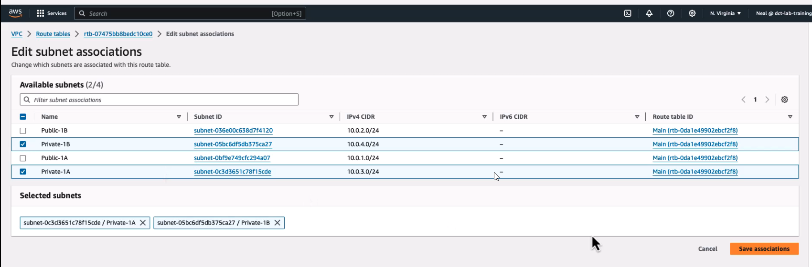
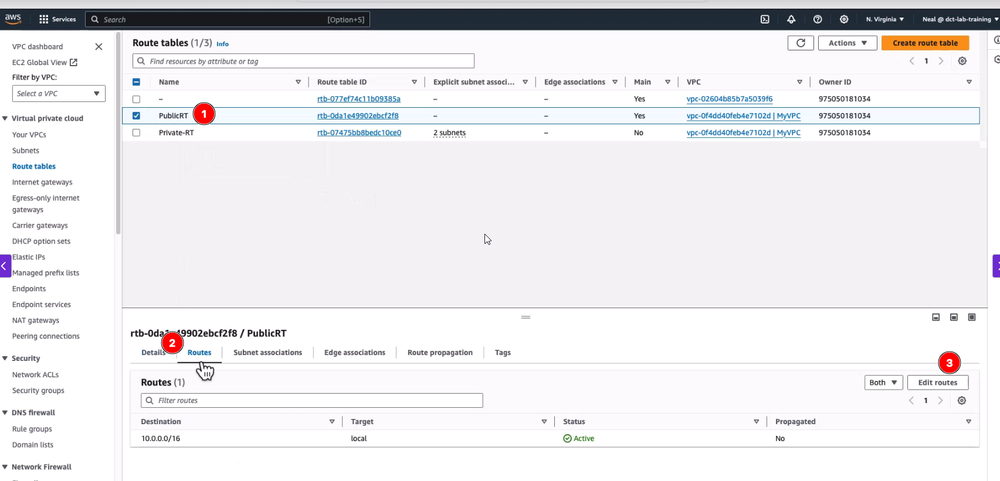
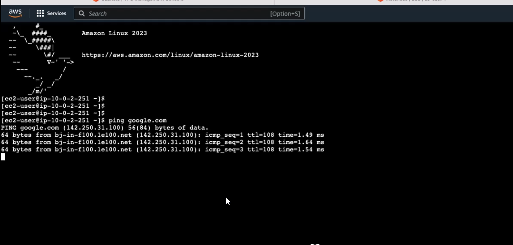

# Create VPC

Name: MyVPC
IPv4 CIDR Block: 10.0.0.0/16

# Create Public and Private Subnets

Name: Public-1A
Availability Zone: us-east-1a
IPv4 CIDR Block: 10.0.1.0/24

> After created edit subnet and select `Enable auto-assign public IPv4 address`

Name: Public-1B
Availability Zone: us-east-1b
IPv4 CIDR Block: 10.0.2.0/24

Name: Private-1A
Availability Zone: us-east-1a
IPv4 CIDR Block: 10.0.3.0/24

Name: Private-1B
Availability Zone: us-east-1b
IPv4 CIDR Block: 10.0.4.0/24

# Create private route table

Name: Private-RT
VPC: MyVPC

> Subnet associations: Private-1A, Private-1B

# Create Internet Gateway

Name: MyIGW
VPC: MyVPC

> Attache to VPC created above

# Attach public route table

aws provide a public default route table 

# For Testing 

1. Launch a new EC2 instance
2. Amazon Linux
3. T2.micro
4. Proceed without a key pair
5. VPC (created above)
6. Subnet (created above - Public-1b)
7. Auto-assign public IP - Enable
8. **LUNCH INSTANCE**

> * validate if inside this instace segurity group was assigned
> * Public IPv4 is assigned

1. Connect to instance - connect

2. Inside this instance run the following command

   1. `ping google.com`

   