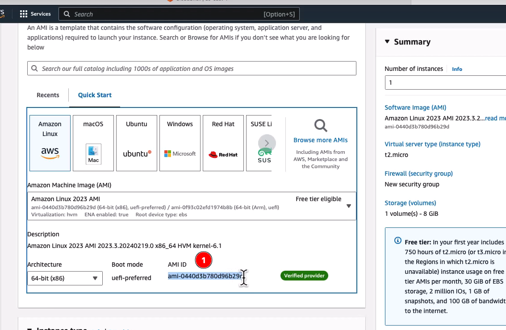
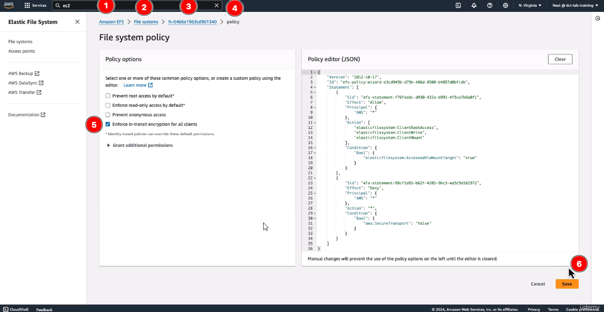
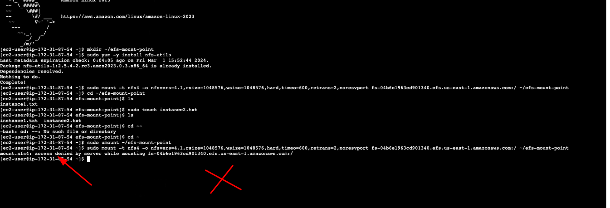

# Working with EFS

[class 27](https://www.udemy.com/course/aws-certified-developer-associate-exam-training/learn/lecture/43290712?start=60#overview)

## Launch instances in multiple AZs

1. Go to Cloudshell 
2. Create a security group
  1. `aws ec2 create-security-group --group-name StorageLabs --description "Temporary SG for the Storage Service Labs"`,  <SECURITY-GROUP-ID>, replace it in all file
  2. this command will return 

3. Add a rule for SSH inbound to the security group
  `aws ec2 authorize-security-group-ingress --group-name StorageLabs --protocol tcp --port 22 --cidr 0.0.0.0/0`
4. Launch instance in US-EAST-1A
  `aws ec2 run-instances --image-id <LATEST-AMI-ID> --instance-type t2.micro --placement AvailabilityZone=us-east-1a --security-group-ids <SECURITY-GROUP-ID>`
  1. <LATEST-AMI-ID> will be find inside EC2 instance AMI ID
  2. 

5. Launch instance in US-EAST-1B
  `aws ec2 run-instances --image-id <LATEST-AMI-ID> --instance-type t2.micro --placement AvailabilityZone=us-east-1b --security-group-ids <SECURITY-GROUP-ID>`

## Create an EFS File System

1. Add a rule to the security group to allow the NFS protocol from group members

```aws ec2 authorize-security-group-ingress --group-id <SECURITY-GROUP-ID> --protocol tcp --port 2049 --source-group <SECURITY-GROUP-ID>```

2. Create an EFS file system through the console, and add the StorageLabs security group to the mount targets for each AZ

## Mount using the NFS Client (perform steps on both instances)
1. Create an EFS mount point
  `mkdir ~/efs-mount-point`

2. Install NFS client
  `sudo yum -y install nfs-utils`

3. Mount using the EFS client
  `sudo mount -t nfs4 -o nfsvers=4.1,rsize=1048576,wsize=1048576,hard,timeo=600,retrans=2,noresvport <EFS-DNS-NAME>:/ ~/efs-mount-point`

4. Create a file on the file system

   * cd ~/efs-mount-point
   * instance.txt

5. Add a file system policy to enforce encryption in-transit

   

6. Unmount (make sure to change directory out of efs-mount-point first)
  `sudo umount ~/efs-mount-point`

7. Mount again using the EFS client (what happens?)

   1. No, because EFS do not support transition encryption in-transit

   

## Mount using the EFS utils (perform steps on **both instances**)

1. Install EFS utils
  `sudo yum install -y amazon-efs-utils`
2. Mount using the EFS mount helper
  `sudo mount -t efs -o tls <EFS-DNS-NAME>:/ ~/efs-mount-point`

> [!IMPORTANT]
>
> REMEMBER DELETE ALL INSTANCES

