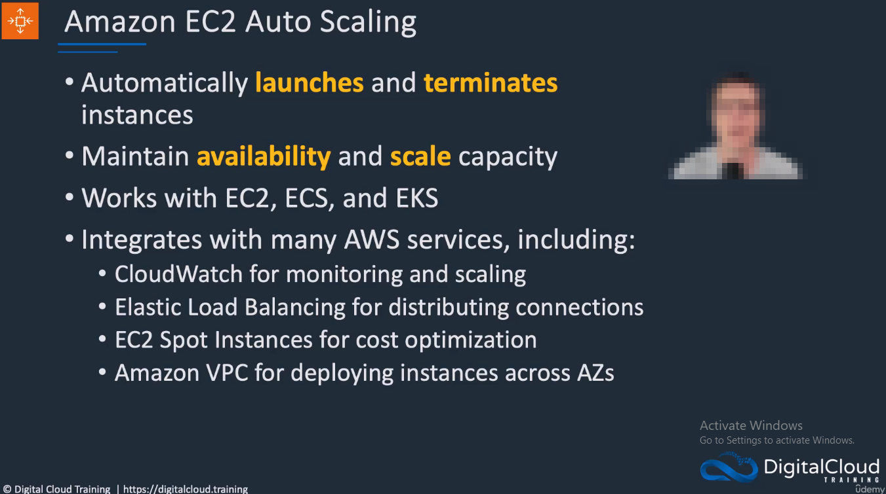
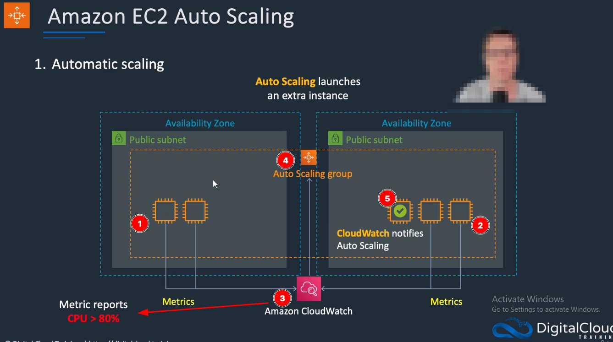
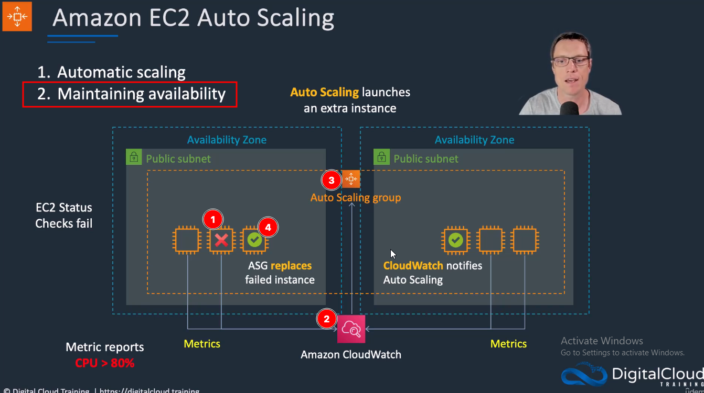

[Clase 38](https://www.udemy.com/course/aws-certified-developer-associate-exam-training/learn/lecture/35901370#overview)

## Step 1: Create auto scaling group

* <PUBLIC-SUBNET-1A-ID> and <PUBLIC-SUBNET-1B-ID> were created on custom-vpc.md

```bash
aws autoscaling create-auto-scaling-group --auto-scaling-group-name ASG2 --launch-template "LaunchTemplateName=MyEC2WebApp" --min-size 1 --max-size 3 --desired-capacity 2 --availability-zones "us-east-1a" "us-east-1b" --vpc-zone-identifier "<PUBLIC-SUBNET-1A-ID>, <PUBLIC-SUBNET-1B-ID>" 
```

## Step 2: Create load balancer, create listener, and attach to TG1 to ASG2


```bash
#<SECURITY-GROUP-ID> was created on step 1
aws elbv2 create-load-balancer --name ALB2 --subnets <PUBLIC-SUBNET-1A-ID> <PUBLIC-SUBNET-1B-ID> --security-groups <SECURITY-GROUP-ID>

#<ARN:LOAD-BALANCED> was created above
aws elbv2 create-listener --load-balancer-arn <ARN:LOAD-BALANCED> --protocol HTTP --port 80 --default-actions Type=forward,TargetGroupArn=<ARN:TARGET-GROUP>

aws autoscaling attach-load-balancer-target-groups --auto-scaling-group-name ASG2 --target-group-arns <ARN:TARGET-GROUP>

```


## delete ASG2 and ALB2

```bash
aws elbv2 delete-load-balancer --load-balancer-arn <ARN:LOAD-BALANCED>

aws autoscaling delete-auto-scaling-group --auto-scaling-group-name ASG2 --force-delete
```

