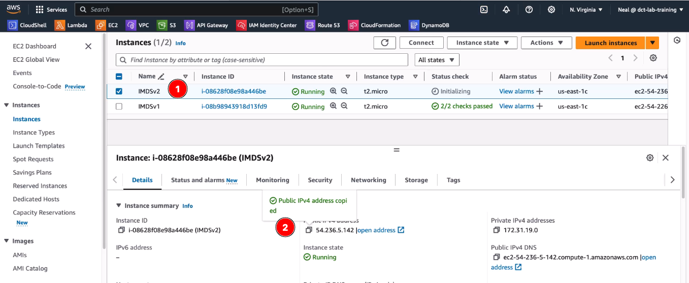

# IMDS v1

### Lunch Instance basic: IMDS v1

1. Launch a new EC2 instance

2. Amazon Linux

3. T2.micro

4. Proceed without a key pair

5. VPC - default

6. Subnet  - default

7. Auto-assign public IP - Enable

8. Firewall (security group)

   1. Select existing security group

   2. > [!IMPORTANT]
      >
      > Select a Sg that allows port 22 for remote secure shell and port 80 for run web server

      

9. **Expand** Advanced details

   1. Metadata version: V1 and V2 (token optional)
   2. Select Metadata response hop limit: **2**

10. **LUNCH INSTANCE**

## Example commmands to run:

1. Get the instance ID:
`curl http://169.254.169.254/latest/meta-data/instance-id`

2. Get the AMI ID:
curl http://169.254.169.254/latest/meta-data/ami-id

3. Get the instance type:
curl http://169.254.169.254/latest/meta-data/instance-type

4. Get the local IPv4 address:
curl http://169.254.169.254/latest/meta-data/local-ipv4

5. Get the public IPv4 address:
curl http://169.254.169.254/latest/meta-data/public-ipv4

# IMDS v2

### Lunch Instance basic: IMDS v2

1. Launch a new EC2 instance

2. Amazon Linux

3. T2.micro

4. Proceed without a key pair

5. VPC - default

6. Subnet  - default

7. Auto-assign public IP - Enable

8. Firewall (security group)

   1. Select existing security group

   2. > [!IMPORTANT]
      >
      > Select a Sg that allows port 22 for remote secure shell and port 80 for run web server

9. **LUNCH INSTANCE**

______

## Step 1 - Create a session and get a token

`TOKEN=$(curl -X PUT "http://169.254.169.254/latest/api/token" -H "X-aws-ec2-metadata-token-ttl-seconds: 21600")`

## Step 2 - Use the token to request metadata

1. Get the instance ID:
`curl -H "X-aws-ec2-metadata-token: $TOKEN" http://169.254.169.254/latest/meta-data/instance-id`

2. Get the AMI ID:
`curl -H "X-aws-ec2-metadata-token: $TOKEN" http://169.254.169.254/latest/meta-data/ami-id`

## Step3 - Use metadata with user data to configure the instance

This script installs a web server and uses instance metadata to retrieve information about the instance and then output the information on a webpage.

```bash
#!/bin/bash

# Update system and install httpd (Apache)
yum update -y
yum install -y httpd

# Start httpd service and enable it to start on boot
systemctl start httpd
systemctl enable httpd

# Fetch metadata using IMDSv2
TOKEN=$(curl -X PUT "http://169.254.169.254/latest/api/token" -H "X-aws-ec2-metadata-token-ttl-seconds: 21600")
INSTANCE_ID=$(curl -H "X-aws-ec2-metadata-token: $TOKEN" http://169.254.169.254/latest/meta-data/instance-id)
AMI_ID=$(curl -H "X-aws-ec2-metadata-token: $TOKEN" http://169.254.169.254/latest/meta-data/ami-id)
INSTANCE_TYPE=$(curl -H "X-aws-ec2-metadata-token: $TOKEN" http://169.254.169.254/latest/meta-data/instance-type)

# Create a web page to display the metadata
cat <<EOF > /var/www/html/index.html
<html>
<head>
    <title>EC2 Instance Metadata</title>
</head>
<body>
    <h1>EC2 Instance Metadata</h1>
    <p>Instance ID: $INSTANCE_ID</p>
    <p>AMI ID: $AMI_ID</p>
    <p>Instance Type: $INSTANCE_TYPE</p>
</body>
</html>
EOF
```

## Step 4 - execute bash file

* Inside cloud shell, run this following commands

```bash
vim script.sh #copy and past above script
chmod +x script.sh

sudo ./script.sh
```

## Step 5 - test config web browser



